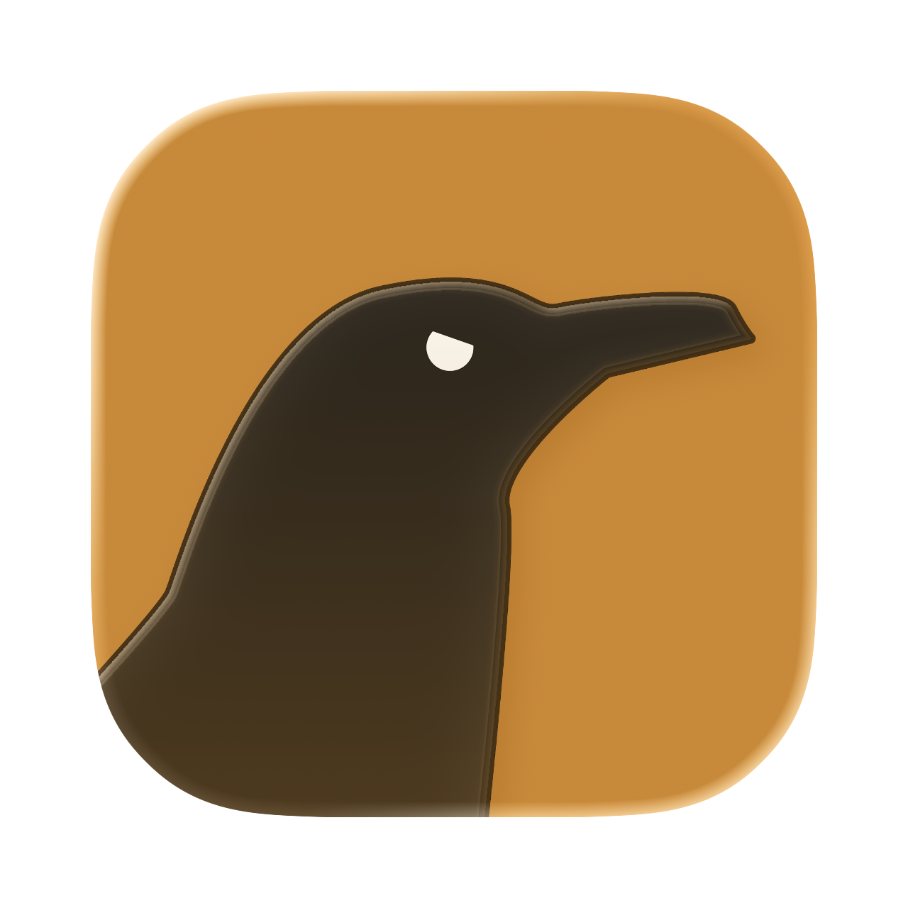

<p align="center">
  <a href="https://github.com/vapourware-studios/sshclient/releases"></a>
  <a href="https://github.com/vapourware-studios/sshclient/issues"></a>
  <a href="https://github.com/vapourware-studios/sshclient/graphs/contributors"></a>
  <a href="https://github.com/vapourware-studios/sshclient"></a>
</p>

<p align="center">
  
</p>

## Overview

**SSH Client** is a fast, reliable and open source ssh client. It allows you to use **remote access clients**, store and generate **ssh keys**, save **command snippets**, **port forward** connections from your hosts and allow you to use inbuilt **SFTP**

## FREE FOREVER CLOUD SYNC

We provide a free forever **secure** cloud storage for all your **hosts**, **keys**, and **code snippets**.

If you dont trust us with our data. Well thats fair... that's why we open source our backend. You want to host it yourself, sure go for it!  

## Why us?

Well why NOT? We are free, open source, we dont take your money. And if you dont like something, your wish is just a **PR** away!

## Getting started

- Install the app

Windows/Linux

[](https://shieldcn.dev/badge/Download-Windows-blue.svg?logo=windows11&size=lg)

Mac OS

```bash
brew install --cask vapourware-studios/tap/sshclient
```

or

[](https://shieldcn.dev/badge/Download-Windows-blue.svg?logo=windows11&size=lg)

- You are done!

## Contributing

Contributions are welcome — open an issue or PR and help make SSH Client better.

### Getting started

1. Fork the repo and clone your fork
2. Install dependencies: `npm install`
3. Run the app in dev mode: `npm run dev`
4. Create a branch for your change: `git checkout -b feat/my-change`

### Before you open a PR

- Keep changes focused — one feature or fix per PR
- Follow the existing code style
- Test that the app builds and runs: `npm run build`
- Reference any related issue in your PR description

### Reporting bugs

Found something broken? [Open an issue](https://github.com/Vapourware-Studios/sshclient/issues) with steps to reproduce, your OS, and the app version.

<p align="center">
  <a href="https://github.com/vapourware-studios/sshclient/graphs/contributors"></a>
</p>

## contact

feedback: please fill in the form in the settings tab of your application

contact us: [website](https://vapourware-studios.net/contact/) or email us at hello@vapourware-studios.net

## Roadmap

| Feature | Status |
|---|---|
| SSH terminal — multi-tab, xterm.js, scrollback | ![Done][done] |
| Dual-pane SFTP with drag-and-drop | ![Done][done] |
| Encrypted vault (scrypt + AES-256-GCM) | ![Done][done] |
| In-app key generation (RSA / ECDSA / Ed25519) | ![Done][done] |
| Local port forwarding (`-L`) | ![Done][done] |
| Serial terminal + session recording | ![Done][done] |
| Termius host/key import | ![Done][done] |
| Encrypted cross-device sync | ![Done][done] |
| Remote & dynamic forwarding (`-R` / SOCKS) | ![In Progress][wip] |
| `known_hosts` import (UI stubbed) | ![In Progress][wip] |
| Intel (x64) Mac builds | ![In Progress][wip] |
| Hardware-tested Windows / Linux builds | ![In Progress][wip] |
| Code-signed & notarized builds | ![In Progress][wip] |
| OpenSSH `~/.ssh/config` + PuTTY import | ![Planned][plan] |
| ProxyJump / bastion chains | ![Planned][plan] |

<!-- status badges -->
[done]: https://shieldcn.dev/badge/Done-green.svg
[wip]:  https://shieldcn.dev/badge/In_Progress-yellow.svg
[plan]: https://shieldcn.dev/badge/Planned-blue.svg
[idea]: https://shieldcn.dev/badge/Idea-slate.svg?variant=outline
